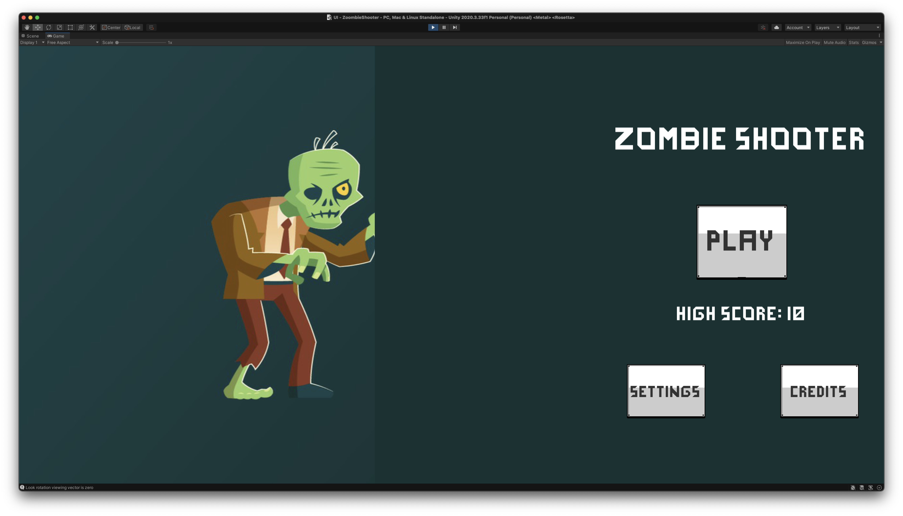
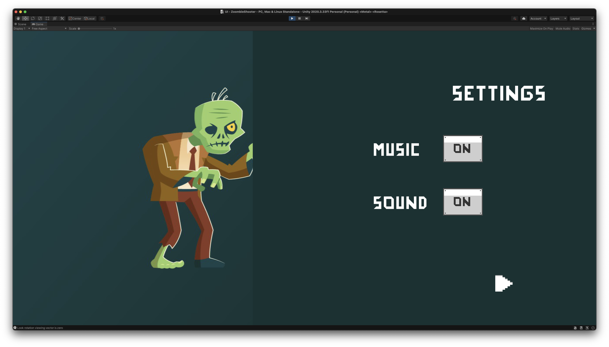
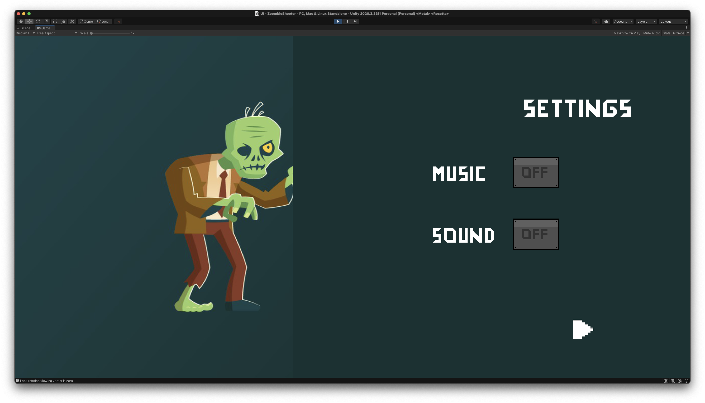
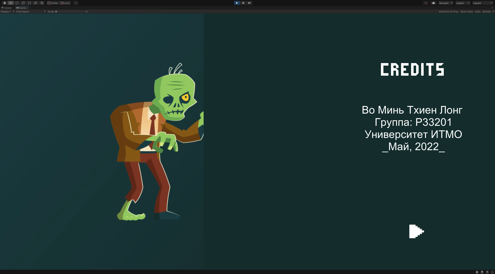
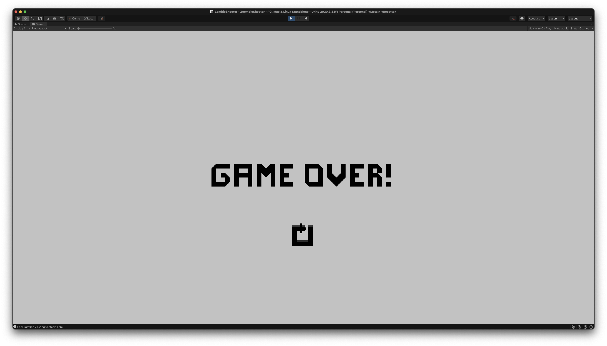

# ZombieShooter

**Автор**: Во Минь Тхиен Лонг.

## Обзор

Я построил этот проект на основе инструкции в этой [ссылка](https://habr.com/ru/company/otus/blog/485210/).

Для создания игры я использовал **Unity** с **C#**, а в качестве ассеты использовал из **Unity Asset Store**.

- [Toony Tiny People](https://assetstore.unity.com/packages/3d/characters/toony-tiny-people-demo-113188#publisher).
- [RPG/FPS Game Assets for PC/Mobile](https://assetstore.unity.com/packages/3d/environments/industrial/rpg-fps-game-assets-for-pc-mobile-industrial-set-v2-0-86679#publisher).
- [Crosshairs Plus](https://assetstore.unity.com/packages/2d/gui/icons/crosshairs-plus-139902).

  

  <i>Игра.</i>

## Новые особенности

Помимо туториала, я использовал свои знания и добавил в игру несколько новых функций:

- Добавить **стартовый экран**.
- Добавить **экран настроек** (`Setting`).
- Добавить **экран кредитов** (`Credits`).
- Добавить **баллы**, когда `Player` убить зомби и сохранить _высокий балл_ (`High score`).
- Добавить **звук** и **музыку** во время игры (`Music` и `Sound`)
- Теперь у `Player` _3 жизни_ (`3 сердца` ❤).
- Использование `NavMesh` - **Navigation Mesh** - _алгоритм ИИ_ для поиска пути.

Некоторые фотографии с новых особенностей:

  

  <i>Стартовый экран (с High score, Settings и Credits).</i>

  

  <i>Экран настроек (настройка Music и Sound - ON).</i>

  

  <i>Экран настроек (настройка Music и Sound - OFF).</i>

  

  <i>Экран кредитов.</i>

  

  

  

  <i>Вы можете видеть сердечко - оставшиеся жизни в игре и баллы - количество зомби, убитых игрой.</i>

  

  <i>Когда у Player не останется жизней (нет сердец), игра будет окончена (Game Over).</i>

  <i>Нажмите кнопку, чтобы начать игру снова.</i>

